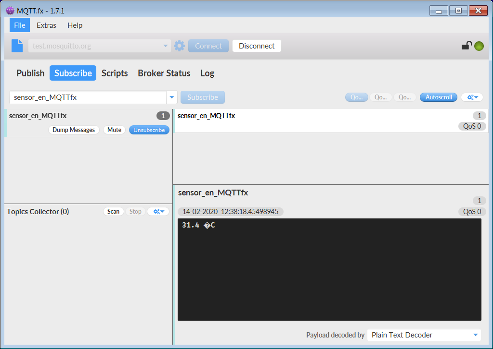
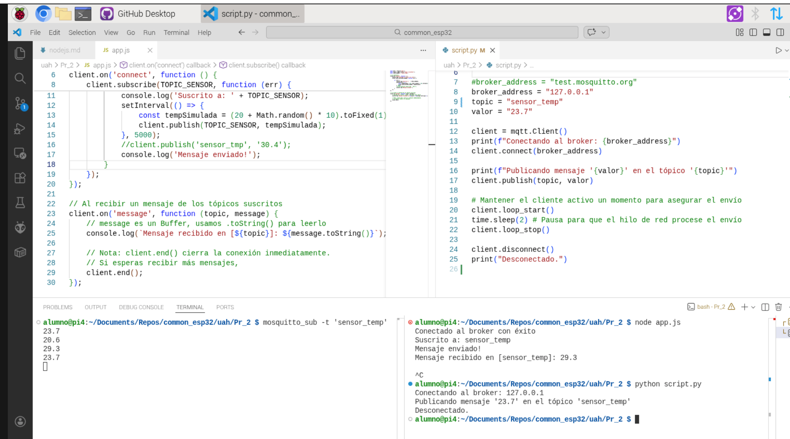

# Protocolo MQTT

Juan Manuel Gago

Jose Miguel Gimeno

**Ejercicio: broker remoto**

Instalar MQTT.fx en dos PCs. Configurar el broker con **test.mosquitto.org** en ambos. En el PC1 suscribirse a un topic. En el PC2 publicar en ese mismo topic. Experimentar con diferentes topic/subtopic y con los wildcard (+ y #).



**Ejercicio: broker local**

Instalar **mosquitto** (broker y clientes) en dos PCs. En la RPi arrancar el broker y en otro shell suscribirse a un topic en la dirección loopback. 

On Window #2 publish a message:

```
mosquitto_pub -d -h 127.0.0.1 -t sensor_temp -m "20.5"
```

Open a new terminal Window #3 and run this command to subscribe to **sensor_temp** topic:

```
mosquitto_sub -d -h 127.0.0.1 -t sensor_temp
```

**Ejercicio: Python (paho)**

En Python3 instalar el módulo paho-mqtt. Para ver los resultados es necesario tener un subscriber suscrito al topic en el correspondiente broker:



NOTA: El script.py que aparece en la figura anterior, se ha renombrado como [test_paho](test_paho.py)

**Ejercicio: JavaScript**

Ejecutar el ejemplo en JavaScript. Para ello es necesario tener instalado Node.js (https://nodejs.org/en/) y el cliente para protocolo MQTT (https://www.npmjs.com/package/mqtt)

```
sudo apt install -y mosquitto mosquitto-clients nodejs npm
```

Instalar el complemento para MQTT:

```
npm install mqtt
```

El resultado es diferene cada vez que se ejecuta:

```
$ node app.js
Conectado al broker con éxito
Suscrito a: sensor_temp
Mensaje enviado!
Mensaje recibido en [sensor_temp]: 31.5
```