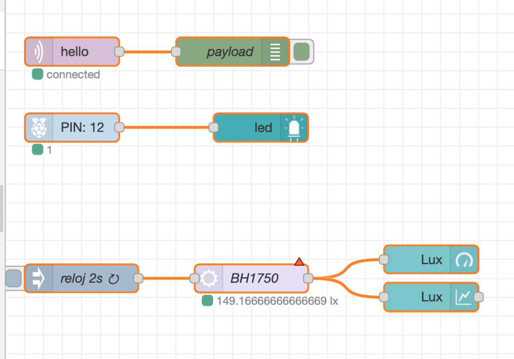
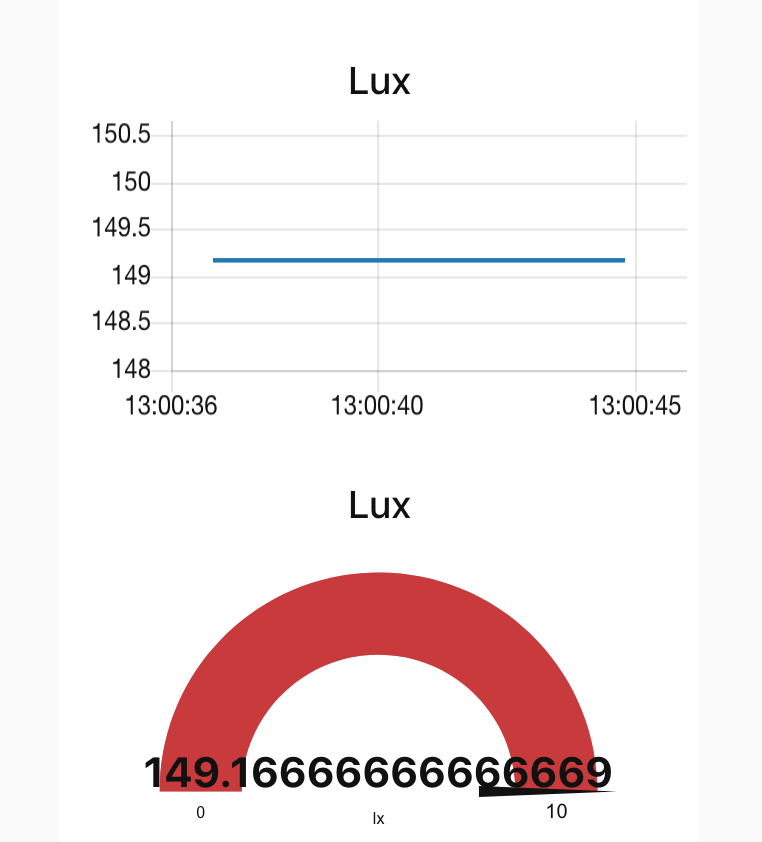

**Ejercico 5A: Dashboard**

Un LED (instalar el paquete ‘node-red-contrib-ui-led’) que indique el estado del GPIO18.

	npm install node-red-node-pi-gpio
	node code/ex03_blink.js 

| NRed | UI |
|------|----|
||  |

**Ejercico 5B: MQTT Publisher and Subscriber**

- Un nodo MQTT que publique el valor del sensor leído


- Un nodo MQTT o Publisher remoto (se puede utilizar la extensión de Google, paho, etc.) para escribir 1 o 0 en el LED conectado al GPIO18.
- Un nodo MQTT que se suscriba a un topic ‘GPIO18’ y que modifica el valor de ese LED virtual GPIO18 cada vez que reciba un valor 1 o 0.


---

Ojo, dentro de una función no se puede usar ‘require’. Es necesario añadirlos todos los ‘require’ en el fichero **settings.js**.  

```
~/.node-red$ cat settings.js

functionGlobalContext: {
	gpio:require('onoff').Gpio,
	i2c:require('i2c-bus'),
	os:require('os'),
	...
	
~/.node-red$ 
```

