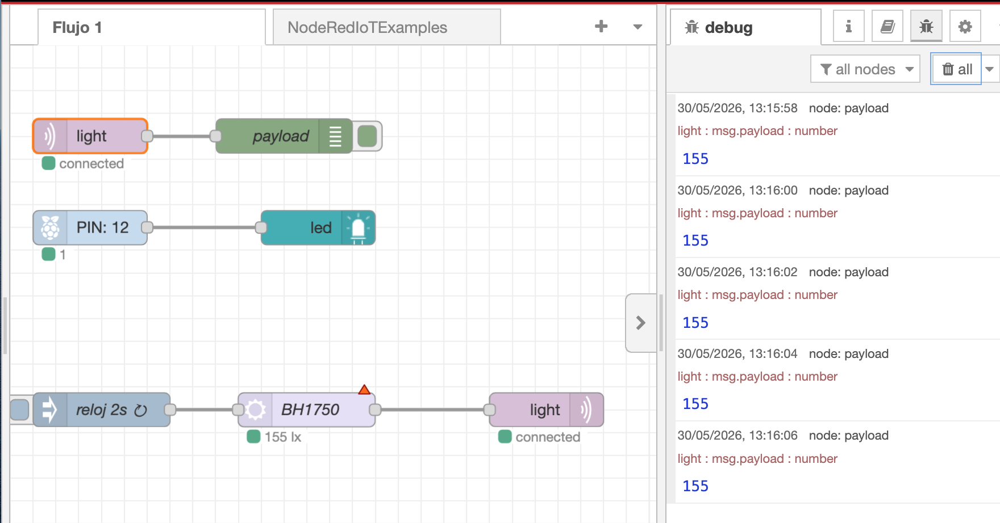

**Ejercico 5A: Dashboard**

Mostrar un LED que indique el estado del GPIO18.

	npm install node-red-node-pi-gpio node-red-contrib-ui-led
	node code/ex03_blink.js 

Mostrar un chart y un gauge (dashboard) en el que se visualice el valor de iluminación 

| NRed | UI |
|------|----|
||  |

**Ejercico 5B: MQTT y sensor I2C**

Mandra el valor del sensor leído por MQTT: nodo MQTT que publique y otro node que lo lea.



---

Ojo, dentro de una función no se puede usar ‘require’. Es necesario añadirlos todos los ‘require’ en el fichero **settings.js**.  

```
~/.node-red$ cat settings.js

functionGlobalContext: {
	gpio:require('onoff').Gpio,
	i2c:require('i2c-bus'),
	os:require('os'),
	...
	
~/.node-red$ 
```

