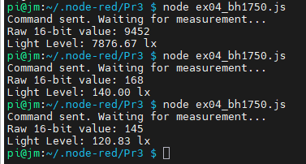
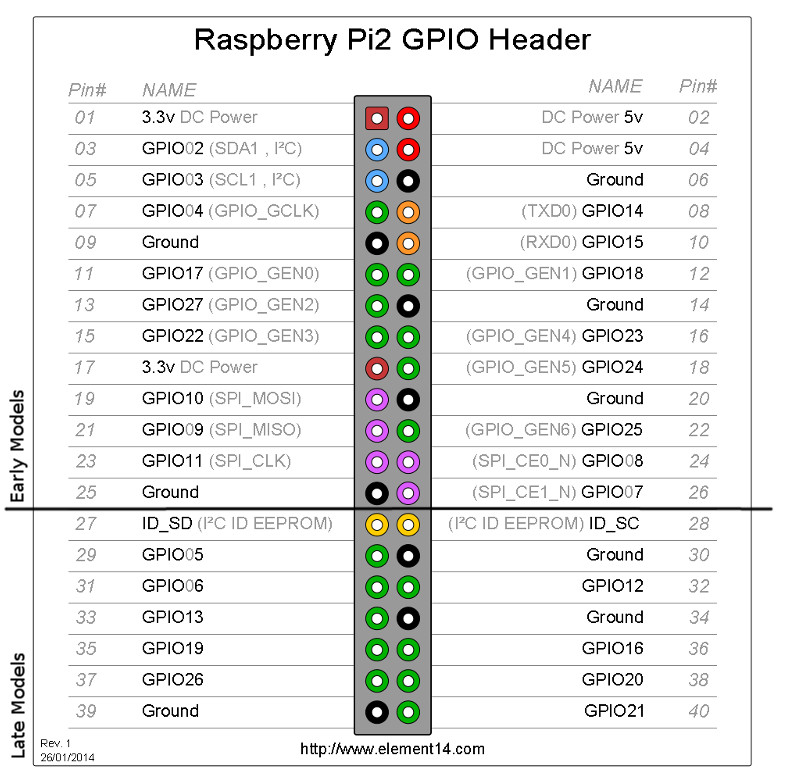

# RPi, JavaScript y Node-RED

Juan Manuel Gago

Jose Miguel Gimeno

**Ejercicio 01. Interfaces en la Raspberry** 

Instalar Raspbbian y realizar los test de los dispositivos I2C, UART y GPIOs.

**Ejercico 02. Counter**

Programar el JS anterior en la Raspberry y ejecutarlo.

```
$ node ex02_count.js 
Hola desde Node.js 
Suma :1234 + 1.234 = 1235.234
Execution 1  
Execution 2  
Execution 3  
Execution 4  
Execution 5  
Interval stopped after 5 executions! 
```

Nota sobre los métodos empleados  - how to control asynchronous loops in JS

- **setInterval**, It schedules a recurring timer. Every **1000 milliseconds (1 second)**, the JS engine pushes your callback function onto the event queue.
- **clearInterval**. Inside the loop, the `if (count === 5)` statement acts as a gatekeeper. JavaScript takes that `intervalId` claim ticket, tears it up, and the background timer immediately stops.

**Ejercicio 3. LED Blinking**

Conectar un LED al pin 18 (530), programar el JS anterior y ejecutarlo.

```
sudo cat /sys/kernel/debug/gpio | grep -i "gpio18"
~/.node-red$ npm install onoff i2c
~/.node-red$ node code/ex03_blink.js
```

Cuando usamos la instuccion **require("onoff")**, el script ha de estar en la carpeta de node-red:

```
~/repo/uah$ ./copiar.sh Pr_3
~/repo/uah$ cd ~/.node-red
~/.node-red$ npm list
node-red-project@/home/alumno/.node-red
├── i2c-bus
├── node-red-dashboard@3.6.6
├── node-red-node-pi-gpio@2.0.7
├── node-red-node-ping@0.3.3
├── node-red-node-random@0.4.1
├── node-red-node-serialport@2.0.3
├── node-red-node-smooth@0.1.2
└── onoff@6.0.3
```

**Ejercicio 4. I2C Sensor** 

Conectar al bus I2C de la Raspberry un [INA219](https://www.ti.com/lit/ds/symlink/ina219.pdf) y un resistor variable. Programar el JS anterior y ejecutarlo tomando varias medidas según posición del potenciómetro. 

```
~/.node-red$ node code/ex04_ina219.js
~/.node-red$ node code/ex04_bh1750.js
```

Hemos anadido un sensor de luminosidad del tipo 



**Ejercico 5: Node-RED**

Instalar el bróker Mosquitto en Raspberry y arrancarlo en una consola. Partiendo de las conexiones de los ejercicios anteriores (LED en GPIO18 y INA219), crear un ‘flow’ en Node-RED de Raspberry que:

- Muestre un chart (dashboard) en el que se visualice el valor de tensión del INA219. 

- Una gauge (dashboard) que visualice el valor de tensión del INA219.

- Un LED (instalar el paquete ‘node-red-contrib-ui-led’) que indique el estado del GPIO18.

  ... 

**Referencias**


