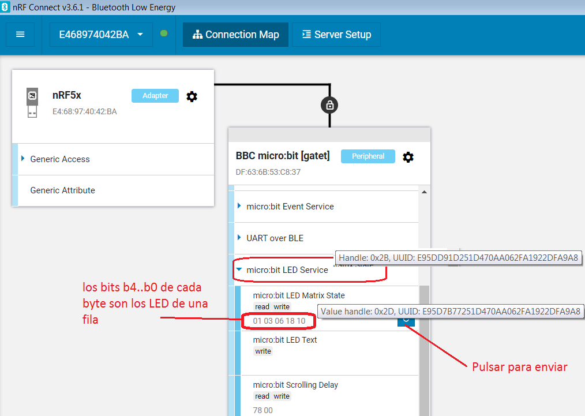
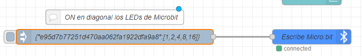
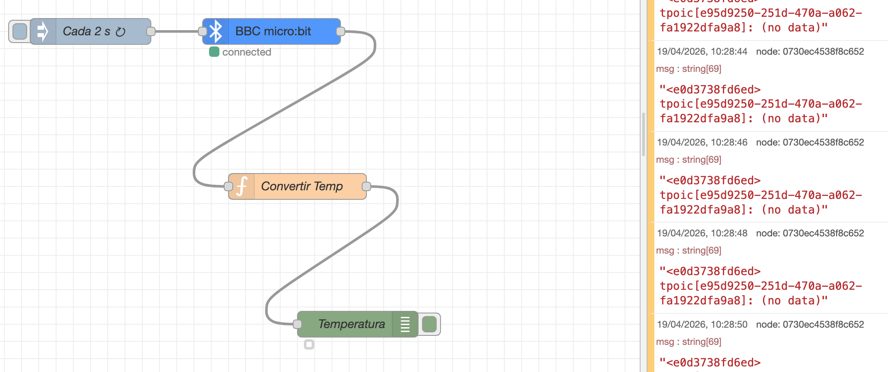
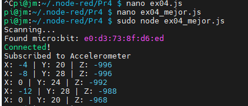
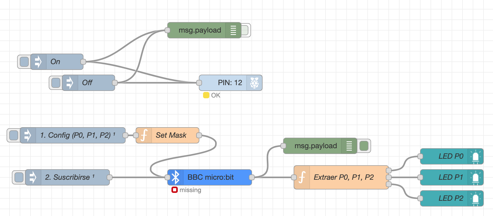
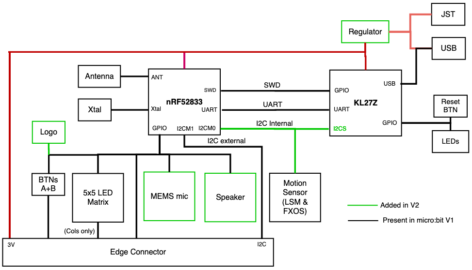
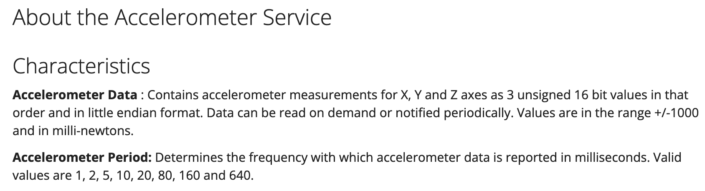
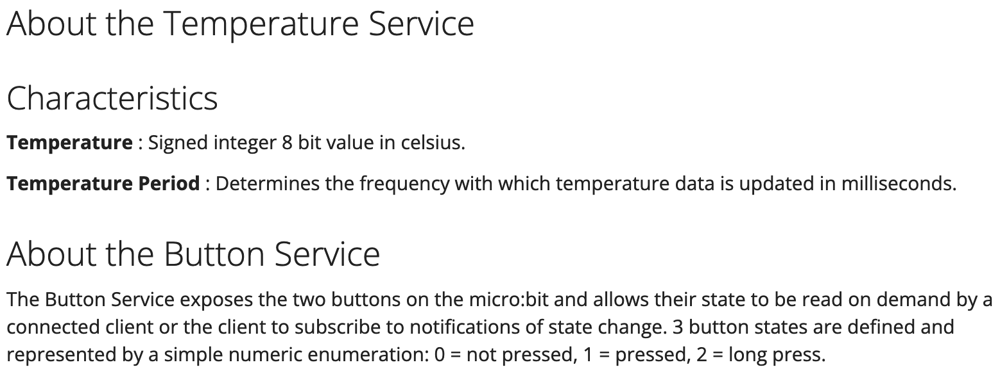
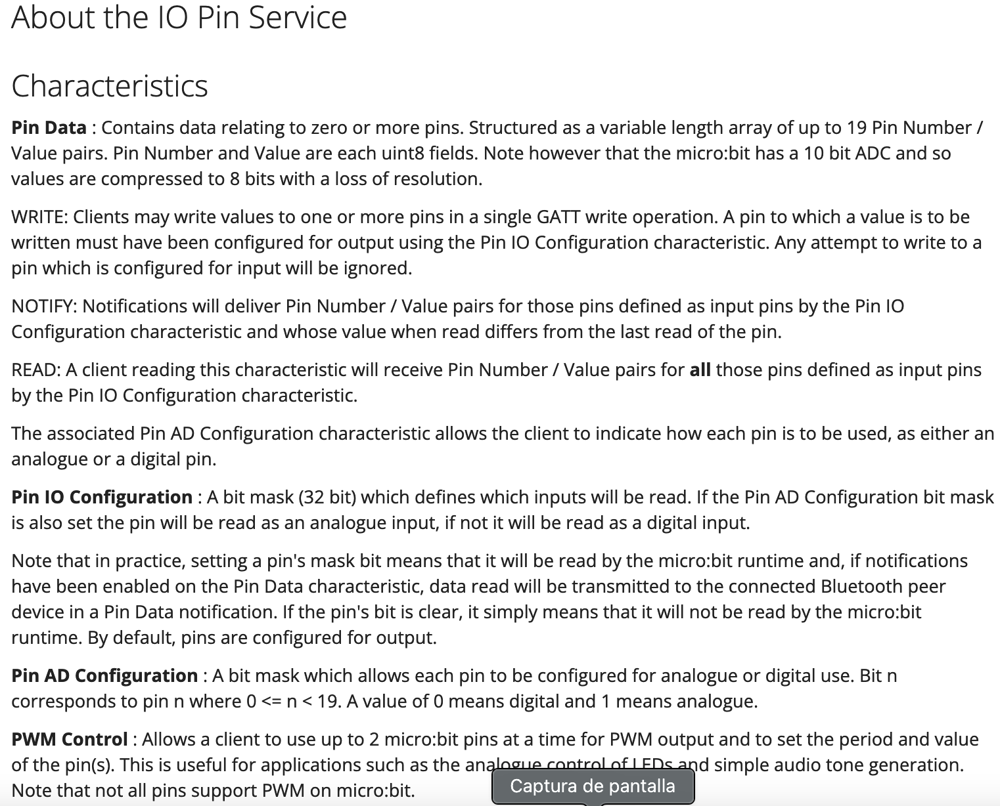

# BLE 

Juan Manuel Gago

Jose Miguel Gimeno

El objetivo de esta práctica es ver como leer, escribir, cambiar notificación de las características de los servicios ofrecidos por un dispositivo con ‘peripheral role’ desde un dispositivo ‘central role’. El hardware usado en esta práctica es:

- Un placa BBC Micro:bit V2.
- Una Raspeberry PI 4.
- Un dongle Nordic nRF52840.

**Microbit V2.0**

En la figura siguiente se muestra el aspecto de **[makecode](https://makecode.microbit.org/#editor)** y la aplicación BLE usada en esta práctica:

```
bluetooth.onBluetoothConnected(function () {
    basic.showIcon(IconNames.SmallSquare)
})
bluetooth.onBluetoothDisconnected(function () {
    basic.showIcon(IconNames.Square)
})
input.onButtonPressed(Button.A, function () {
    basic.showIcon(IconNames.Chessboard)
    bluetooth.uartWriteString("Hola desde BLE")
})
bluetooth.onUartDataReceived(serial.delimiters(Delimiters.Hash), function () {
    basic.showIcon(IconNames.Heart)
})

bluetooth.advertiseUid(9,0,7,true)
bluetooth.setTransmitPower(7)
bluetooth.startUartService()
bluetooth.startIOPinService()
bluetooth.startTemperatureService()
bluetooth.startAccelerometerService()
bluetooth.startLEDService()
basic.showIcon(IconNames.Square)
```

**EJERCICIO 1. nRFConnect**

- Conectar la placa Microbit a Windows 10; Windows instalará automáticamente los driver para el puerto COM virtual y para el debugger
- Instalar **nRFConnect**, abrirlo e instalar el paquete ‘Bluetooth Low Energy’.
  - Conectar el dongle nRF52840.
  - Abrir (desde nRFConnect) ‘Bluetooth Low Energy’ y conectarse con la MicroBit
        - Comprobar MAC y los servicios LED y Accelerometer.
            - Poner en ON todos los LEDs de las filas 1 y 5.
            - Modificar el periodo de actualización de los datos del acelerómetro y modificar su descriptor para que permita notificación.



Nuestras microbits tienen las MAC:

- Jose Miguel d9:05:09:08:B3:C6 
- Juan Manuel e0:d3:73:8f:d6:ed

**EJERCICIO 2. Node-RED: Acelerómetro**

- Añadir el código necesario para representar las componentes X, Y, Z en el chart.
- Añadir los nodos necesarios para que cada vez que se lee el acelerómetro la fila 3 de la matriz de LEDs haga un toggle.

**Nota: envio a una característica de la Micro:bit**

Vamos a enviar 5 bytes a la característica ‘LED matrix state’:



**EJERCICIO 3. Node-RED: Temperatura**

- Quitar el servicio de acelerómetro y añadir a la Microbit el servicio de temperatura.
- Añadir todos los nodos necesarios en Node-RED para leer la temperatura cada 2 segundos 
- Representarlos en un chart, en un rango de 0 ºC a 50 ºC.



**EJERCICIO 4. Javascript: Acelerometro**

- Comprobar el funcionamiento del [código](ex04.js), cambiando el periodo de notificación a 160 ms.
- Grabar un [video](https://github.com/asciinema/asciinema) en el que se muestren los resultados por la consola de Mobaxterm.



**EJERCICIO 5. Propuesta OPCIONAL.**

- Crear un flow de Node-RED en el que el programa anterior, que lee el acelerómetro, almacene el valor del acelerómetro en una variable global y esa variable global sea representada en un chart del dashboard de Node-RED.

**EJERCICIO 6.**

Reprogramar la Microbit quitando el servicio de acelerómetro, temperatura y UART y añadir el **servicio IO**. Crear un flow de Node-RED que:

- Lea 3 sensores analógicos y los muestre en tres gauges del dashboard.
- Lea 3 entradas digitales y los muestre en 3 LEDs del dashboard.
- Configure 3 salidas digitales que se puedan poner a 0 y a 1 con tres botones del dashboard.
- (Opcional) Configure una salida PWM y 2 objetos del dashboard que permitan variar periodo y ciclo de trabajo.



**References**

- Microbit [pinout](https://makecode.microbit.org/device/pins)









El significado de esos servicios, características, UUIDs, etc., se pueden ver en detalle en su [documentación](https://lancaster-university.github.io/microbit-docs/resources/bluetooth/bluetooth_profile.html). 

