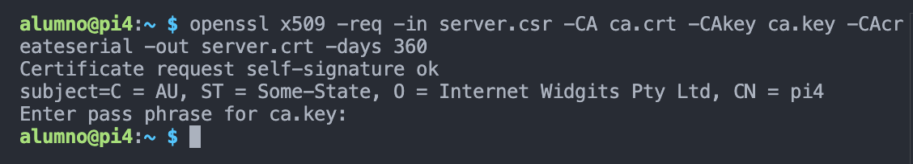

# MQTT con SSL/TSL

Jose Miguel Gimeno

Juan M. Gago (27/05)

En esta práctica se introducen las comunicaciones MQTT con seguridad (autenticación).

## A1. MQTT con user/password

En primer lugar es necesario añadir al fichero de configuración del broker (mosquitto_passwd.conf) lo siguiente:

     == allow_anonymous false
    password_file c:\mosquitto\passwd_test.txt

Hay que crear un fichero de usuarios y passwords, un par user:passwd por línea. En el fichero ‘passwd_test.txt’ sólo hay un usuario (jmra: jmra1)

Ejecutamos

    $ mosquitto_passwd -U .\passwd_test.txt

A continuación se arranca el broker especificando el fichero de configuración a usar, ‘mosquitto_passwd.conf’:

    $ mosquitto -c mosquitto_passwd.conf -v

Subscriber (otra consola) 

    $ mosquitto_sub -h localhost -p 1883 -t "jmra" -u 'jmra' -P 'jmra1'

Publisher (otra consola)

    $ mosquitto_pub -h localhost -p 1883 -t "jmra" -u 'jmra' -P 'jmra1' -m 'Hola people'

Captura del paquete de conexión para ver user y password en texto plano: 

## A2. MQTT con user/password en Node-RED

Instalar Node.js y node-RED en Windows. Crear en Node-RED un flow con nodos MQTTs con seguridad user/password:

Capturamos la comunicación entre ambos nodos

---

## B1. Seguridad en MQTT usando SSL/TSL

Instalar OpenSSL y crear los diferentes certificados y keys. 

De la autoridad certificadora (ca.crt)

Ahora firmamos el certificado del broker con el certificado ca.crt:

Al arrancar mosquitto broker con seguridad SSL/TSL, se obtiene un error:

    sudo systemctl restart mosquitto.service
    Job for mosquitto.service failed because the control process exited with error code.
    See "systemctl status mosquitto.service" and "journalctl -xeu mosquitto.service" for details.

Comunicar los clientes mosquitto_pub y mosquitto_sub (consola). 

- Script para escuchar un topic [subscriber](code/subscriber.sh)
- Script para publicar un mensaje [publisher](code/client.sh)

Capturar los paquetes obtenidos y ver que son indescifrables:

## B2. Seguridad usando SSL/TSL en Node-RED

Modificar el flow del ejercicio anterior y comprobar su correcto funcionamiento con SSL/TSL.

Capturar la pantalla de debug de Node-RED para añadir evidencia de funcionamiento:

NOTA: No hay nada que capturar debido al error en la seccion B1