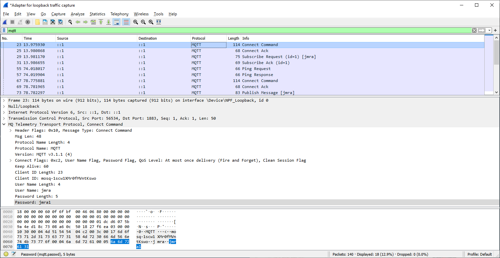
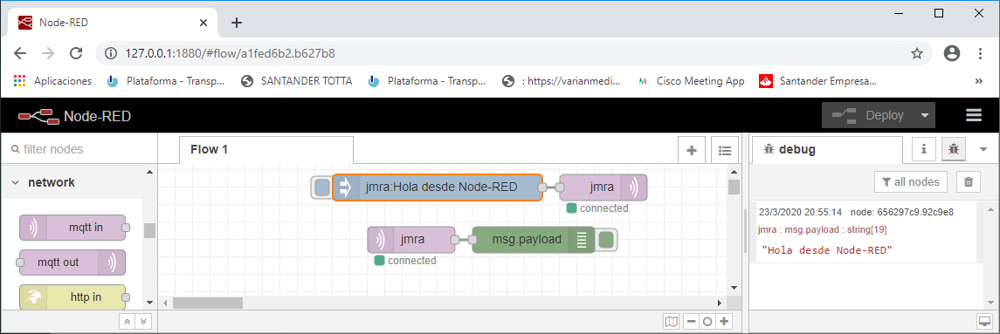
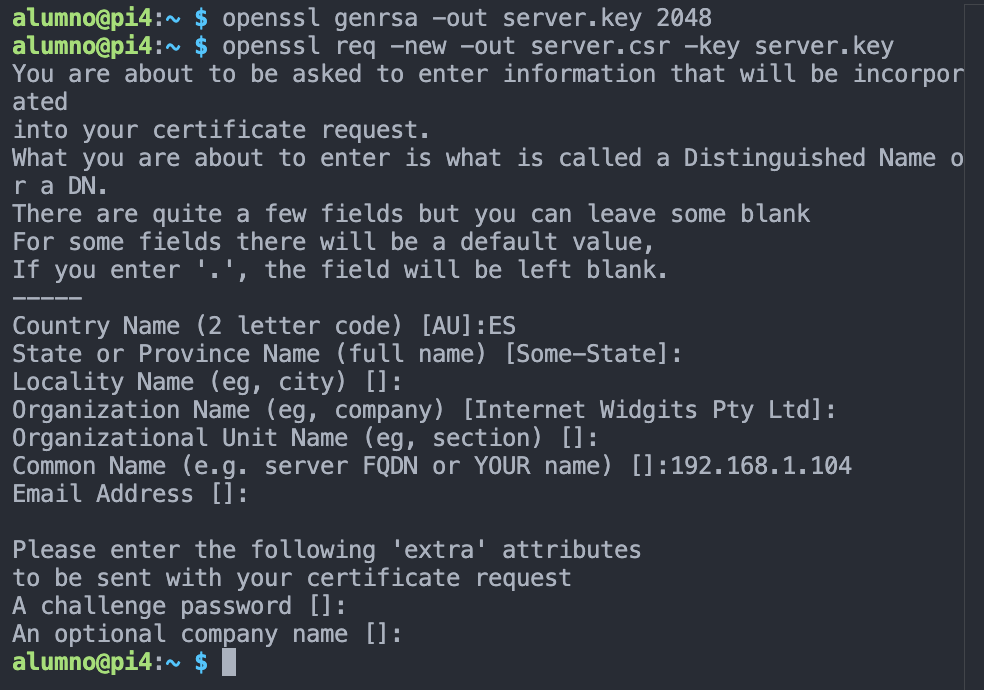
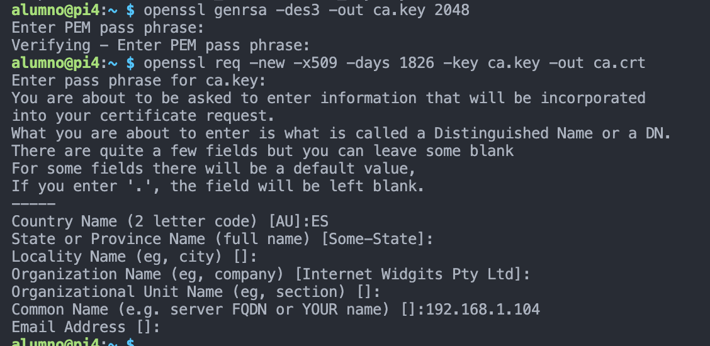
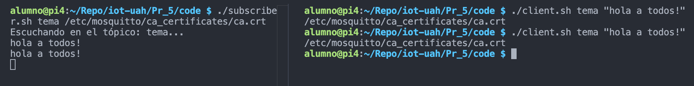
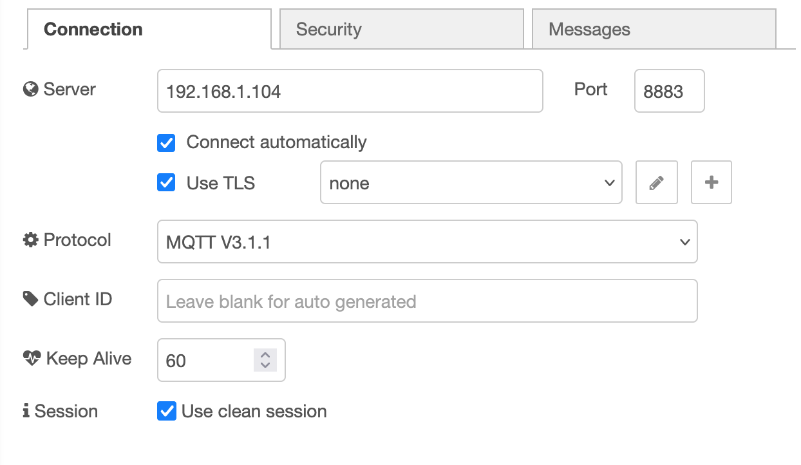
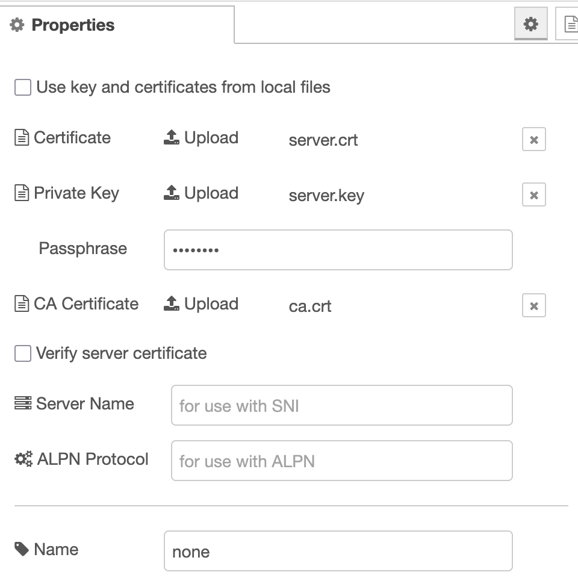

# MQTT con SSL/TSL

Jose Miguel Gimeno

Juan M. Gago (27/05)

En esta práctica se introducen las comunicaciones MQTT con seguridad (autenticación).

## A1. MQTT con user/password

En primer lugar es necesario añadir al fichero de configuración del broker (mosquitto_passwd.conf) lo siguiente:

     == allow_anonymous false
    password_file c:\mosquitto\passwd_test.txt

Hay que crear un fichero de usuarios y passwords, un par user:passwd por línea. En el fichero ‘passwd_test.txt’ sólo hay un usuario (jmra: jmra1)

Ejecutamos

    $ mosquitto_passwd -U .\passwd_test.txt

A continuación se arranca el broker especificando el fichero de configuración a usar, ‘mosquitto_passwd.conf’:

    $ mosquitto -c mosquitto_passwd.conf -v

Subscriber (otra consola) 

    $ mosquitto_sub -h localhost -p 1883 -t "jmra" -u 'jmra' -P 'jmra1'

Publisher (otra consola)

    $ mosquitto_pub -h localhost -p 1883 -t "jmra" -u 'jmra' -P 'jmra1' -m 'Hola people'

Captura del paquete de conexión para ver user y password en texto plano: 

## A2. MQTT con user/password en Node-RED

Instalar Node.js y node-RED en Windows. Crear en Node-RED un flow con nodos MQTTs con seguridad user/password:

Capturamos la comunicación entre ambos nodos

---

## B1. Seguridad en MQTT usando SSL/TSL

### Configuracion del Broker

Instalar OpenSSL y crear los diferentes certificados del servidor:

De la autoridad certificadora (con password):

Ahora firmamos el certificado del broker con el certificado ca.crt:

    openssl x509 -req -in server.csr -CA ca.crt
    Certificate request self-signature ok
    subject=C = ES, ST = Some-State, O = Internet Widgits Pty Ltd, CN = 192.168.1.104
    Enter pass phrase for ca.key:

**Nota**: siempre usamos el mismo Common Name (la IP de la raspberry en nuestra red).

Ahora tenemos que ir al directorio /etc/mosquitto y colocar las keys y certificado. Pero para no hacerlo manual, hemos automatizado los pasos en un script que hemos llamado [instala_certs](code/instala_certs.sh). 

Al final, arrancar el mosquitto broker con seguridad SSL/TSL sin mayor problemas.

### Clientes

Los clientes mosquitto_pub y mosquitto_sub se empaquetan en unos scripts que facilitan su uso:

    $ ./subscriber.sh tema /etc/mosquitto/ca_certificates/ca.crt
    $ ./client.sh tema "hola a todos!" /etc/mosquitto/ca_certificates/ca.crt

**Ojo**! Tanto el script para escuchar [subscriber](code/subscriber.sh) como el que publica mensajes [publisher](code/client.sh) en ese topic,  hacen uso de la IP que hemos configurado los certificados.

## B2. Seguridad usando SSL/TSL en Node-RED

Modificar el flow del ejercicio anterior y comprobar su correcto funcionamiento con SSL/TSL.

Hemos llamado **none** a la configuracion siguiente:

NOTA: Hemos introducido el fichero ca.crt y la password que usamos en su creación pero sin éxito. En todo momento el cliente MQTT mostraba el mensaje connecting...

