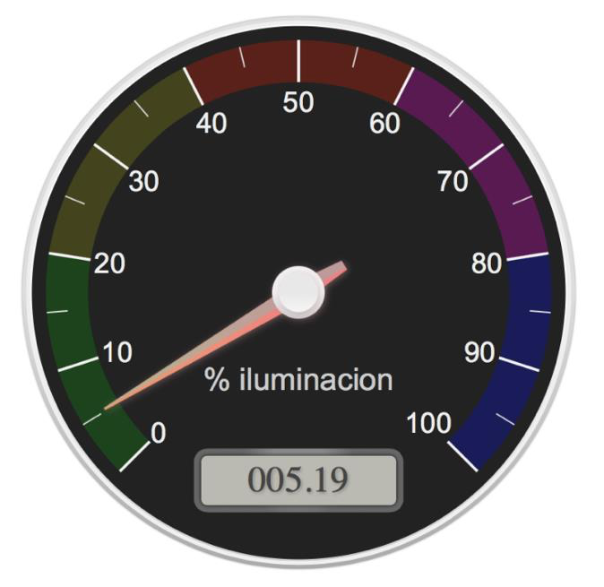
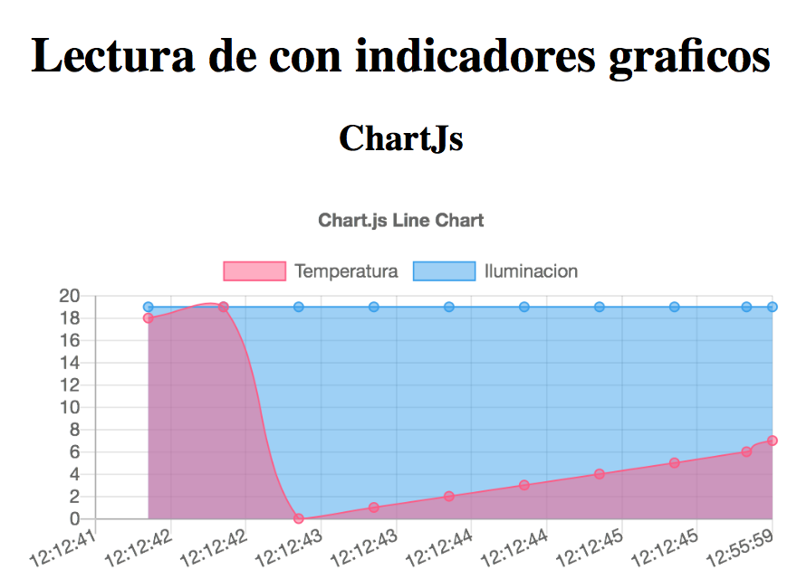

# Visualizadores gráficos avanzados (canvas)

A continuación se muestran varios ejemplos de ficheros HTML que pretenden enseñar la forma de visualizar datos recibidos desde un servidor MQTT

1. Utilizando [canvas](https://www.w3schools.com/graphics/canvas_intro.asp) en HTML
1. Uso de librerías de controles predefinidas
1. Uso de la librería Chart.js

## Flow (RPi)

## Ejemplo 9

## Ejemplo 10

