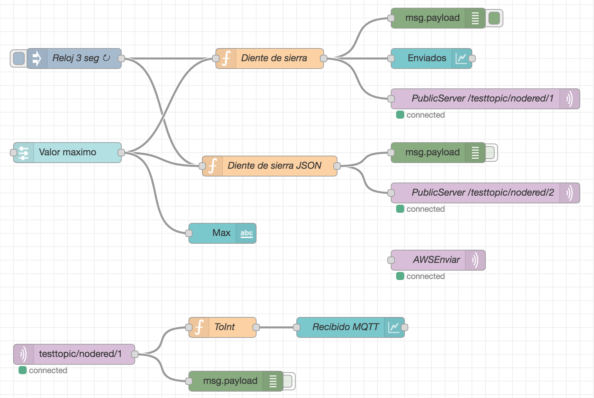
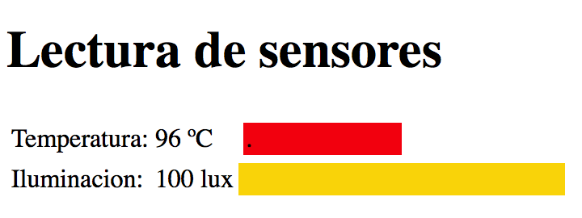

# Visualizadores gráficos con Javascript

A continuación se muestran varios ejemplos de ficheros HTML que pretenden enseñar la forma de visualizar datos recibidos desde un servidor MQTT

1. Página básica de texto de HTML
2. Cambiando el texto desde una función de JavaScritp
3. Representa el valor de una variable en JavaScritp
4. Utiliza la librería de Cliente MQTT sobre WebSockets
5. Cliente MQTT leyendo varias variables en un JSON
6. Representa los valores en una tabla
7. Visualización en barra horizontal
8. Utilizando [canvas](https://www.w3schools.com/graphics/canvas_intro.asp) en HTML
9. Uso de librerías de controles predefinidas
10. Uso de la librería Chart.js

## Ejemplo 4

## Ejemplo 7

