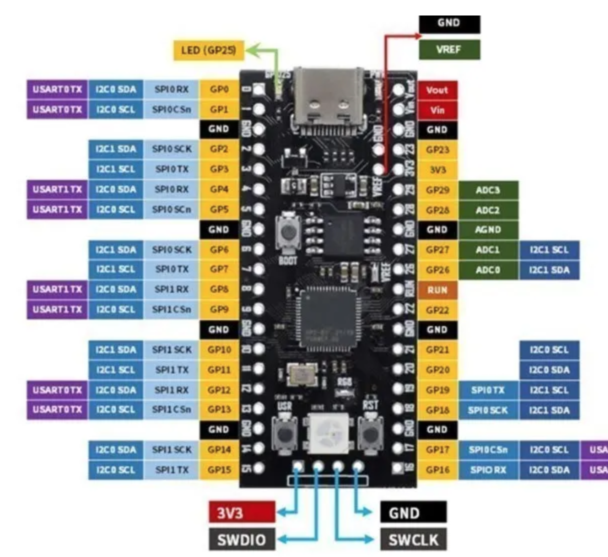

# RP2040

| Clon **YD-RP2040** | Original          |
| ------------------ | ----------------- |
|   |  |

## Hardware

R68 : puente con una gota de estaño (soldadura) para unir ambos extremos

    led = neopixel.NeoPixel(machine.Pin(23), 1)
    led[0] = (255, 0, 0)
    led.write()

WiFi: indirectly by looking to see if network functionality is included in your particular firmware:

    import network
    if hasattr(network, "WLAN"):
        # the board has WLAN capabilities

## References

- Official [page](https://www.raspberrypi.com/documentation/microcontrollers/pico-series.html#layouts)
- [Esquema](https://github.com/initdc/YD-RP2040/blob/master/YD-2040-2022-V1.1-SCH.pdf)