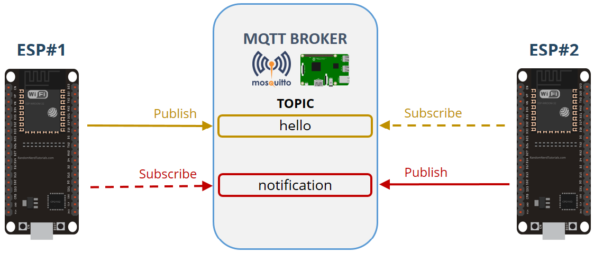

# RuiSantos

## MQTT Hello World

Ejemplo simple de comunicación MQTT

- ESP#1 publishes messages on the **hello** topic. It publishes a “Hello” message followed by a counter (Hello 1, Hello 2, Hello 3, …). It publishes a new message every 5 seconds.

- ESP#2 is subscribed to the **hello** topic. ESP #1 is publishing on this topic, therefore, ESP#2 receives ESP#1 messages.

## Node-Red Client

Ejemplo simple de comunicación MQTT para simular el envío de datos a un servidor Node-RED. En este caso se lee un sensor 1W y se muestra en un chart del dashboard. Tambien hay un led que se puede encender:

## Web Server

Se trata de un [servidor web](Web_Server_Output/main.py) en el que se enciende el LED conectado al GPIO2.