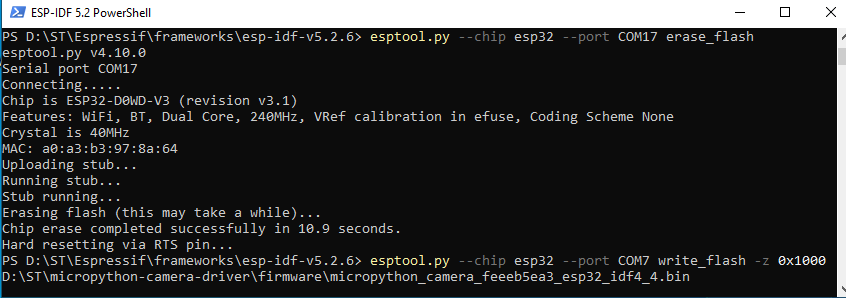

# RuiSanto's Book

Todos estos proyectos comparten el fichero boot.py que gestiona la conexion WiFi.

El fichero [umqttsimple.py](https://github.com/RuiSantosdotme/ESP-MicroPython/tree/master/code/MQTT) es una copia del repositorio de RuiSanto.

## ESPDIF Example

Este ejemplo no usa Micropython!!

## MQTT Hello World

Ejemplo de comunicación MQTT modificado!!

- ESP#1 publishes messages on the **hello** topic.
- It publishes a “Hello” message followed by a counter (Hello 1, Hello 2, Hello 3, …).
- It publishes a new message every 5 seconds.

## Web Server Output

Se trata de un [servidor web](Web_Server_Output/main.py) en el que se enciende el LED conectado al GPIO2.

## ESP-CAM

Hard Reset: Unplug and Plug back into computer with IO0 in two modes

**IO0 to GND** - Bootloader

    esptool.py --chip esp32 --port /dev/ttyUSB0 erase_flash

    esptool.py --chip esp32 --port /dev/ttyUSB0 write_flash -z 0x1000 micropython_camera_feeeb5ea3_esp32_idf4_4.bin

**IO open** - Thonny

A veces hay que editar el archivo confi.ini de Thonny.

    Tools > Open Thonny Data Folder

En la parte de [ESP32] agregar estas lineas:

    dtr = False
    rts = False
