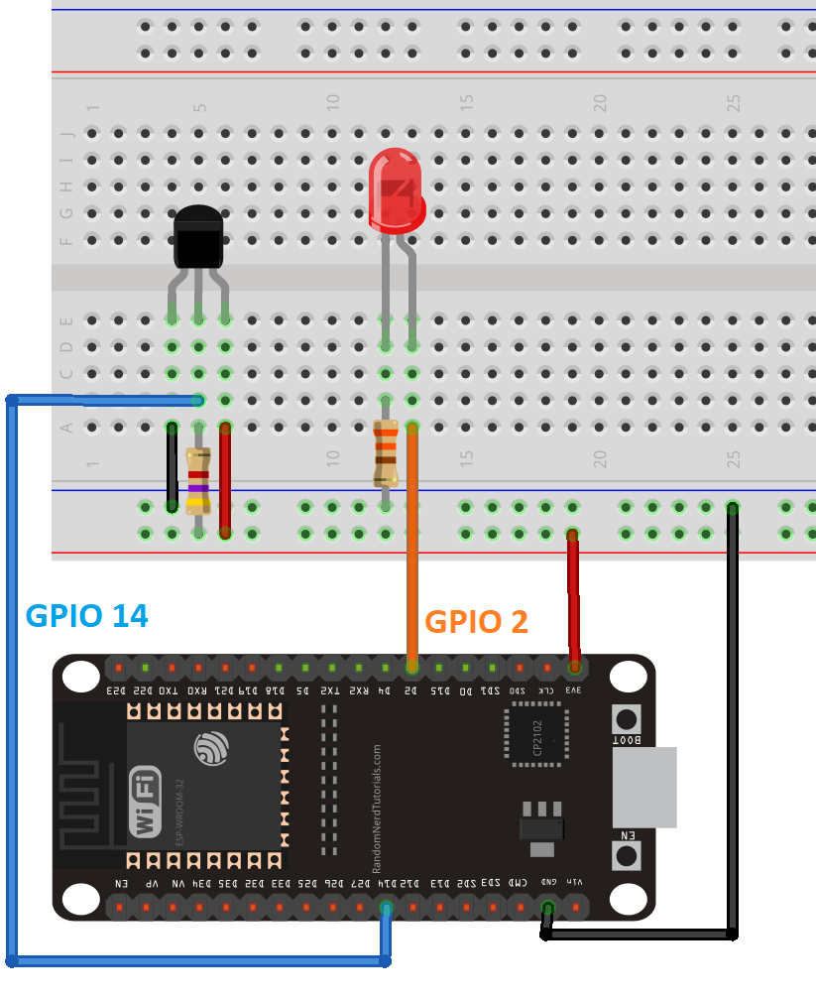
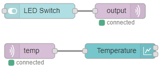

# Bajo Nivel

## Micropython

Echar un vistazo al [libro](https://github.com/RuiSantosdotme/ESP-MicroPython/tree/master)de RuiSantos. Modificar el [ejemplo](code/Node_RED_Client/main.py) de comunicación MQTT para simular el envío de datos a un servidor Node-RED. En este caso se lee un sensor 1W y se muestra en un chart del dashboard. Tambien hay un led que se puede encender:

- Se simularán dos sensores en el ESP32 y se enviarán los datos a Node-RED cada 4 s.

## STM32L475E - Aplicación MQTT genérica

Compilar el proyecto con STM32CubeIDE (es necesario convertirlo de SW4STM32)

- Añadir una variable **contador** a los datos enviados por el Publisher que indique el número de paquetes enviados, seguir las instrucciones del apartado 11 del manual de usuario.

- Abrir el puerto serie a 115200 bps, introducir SSID y PASSWD del router WiFi

- Suscribirse al broker y recibir todos los topics

    `HostName=192.168.43.231;HostPort=1883;ConnSecurity=0;MQClientId=ID_jmra;`

- Introducir (utilizar TERATERM -> edit -> paste<CR>) el certificado Comodo.crt disponible en:

    `.\STM32CubeExpansion_Cloud_CLD_GEN_V1.0.0\Projects\Common\GenericMQTT `

- Presentar datos en NODE-RED

## STM32L475E - Aplicación Grovestreams

- Compilar el proyecto, ubicado en:

    `.\STM32CubeExpansion_Cloud_CLD_GEN_V1`

- Seguir la configuración en el apartado 17 del manual de usuario UM2347

El objetivo de esta parte de la practica es aprender a configurar una cuenta en **Grovestreams** y visualizar los datos enviados por la aplicación de referencia de ST. Si se desea, igual que en el ejercicio 1, se pueden añadir un **contador** a los datos enviados por el client.

