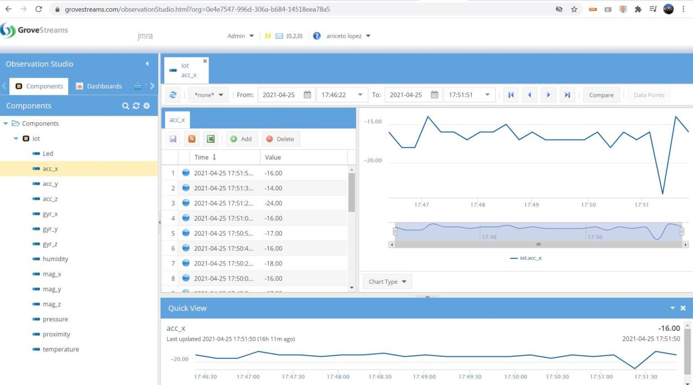

# MQTT con Micropython

Jose Miguel Gimeno

Juan M. Gago (27/05)

## A. Micropython

Echar un vistazo el [github](https://github.com/RuiSantosdotme/ESP-MicroPython/tree/master) del libro de RuiSantos. Modificar el ejempl *Hello_MQTT* para enviar periodicamente los datos de corriente de un sensor I2C (similar al ina219).El [codigo](code/MQTT_Hello/main.py) usa el driver INA3221.py:

En node-red se ha creado el flujo que lee el JSON enviado y separa el campo **temp** y lo muestra en un chart; un numerico para el campo **cont** (contador de muestras, cada 6s):

Nota: en vez de **temp** se es esta usando la funcion **get_current**(). Se puede ir jugando con el resto de funciones de la API: get_bus_voltage(), get_shunt_voltage(), etc.

## B. STM32L475E - Aplicación MQTT genérica

Compilar el proyecto con STM32CubeIDE (es necesario convertirlo de SW4STM32)

- Añadir una variable **contador** a los datos enviados por el Publisher que indique el número de paquetes enviados, seguir las instrucciones del apartado 11 del manual de usuario.

- Abrir el puerto serie a 115200 bps, introducir SSID y PASSWD del router WiFi

- Suscribirse al broker y recibir todos los topics

    `HostName=192.168.43.231;HostPort=1883;ConnSecurity=0;MQClientId=ID_jmra;`

- Introducir (utilizar TERATERM -> edit -> paste<CR>) el certificado Comodo.crt disponible en:

    `.\STM32CubeExpansion_Cloud_CLD_GEN_V1.0.0\Projects\Common\GenericMQTT `

- Presentar datos en NODE-RED

## STM32L475E - Aplicación Grovestreams

- Compilar el proyecto, ubicado en:

    `.\STM32CubeExpansion_Cloud_CLD_GEN_V1`

- Seguir la configuración en el apartado 17 del manual de usuario UM2347

El objetivo de esta parte de la practica es aprender a configurar una cuenta en **Grovestreams** y visualizar los datos enviados por la aplicación de referencia de ST. Si se desea, igual que en el ejercicio 1, se pueden añadir un **contador** a los datos enviados por el client.

## Referencias

- [ESP32](https://raw.githubusercontent.com/RuiSantosdotme/ESP32-Course/master/img/ESP32-DOIT-DEVKIT-V1-Board-Pinout-36-GPIOs.png) Wroom32 
