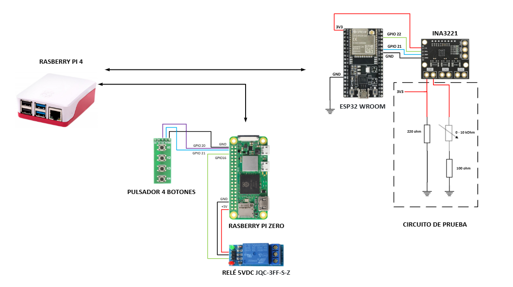

# Practica Libre

Juan M. Gago (03/06)

Jose Miguel Gimeno

1. Introduccion
2. Componentes
3. Codigo empleado

## Introduccion

Se propone el desarrollo de una aplicación para la monitorización de la carga de una bateria. La aplicación utilizará el siguiente hardware:

- Raspberry Pi4 (RPi4) donde corre los servidores de la aplicación
- Raspberry Zero (pizero) con un rele y cuatro pulsadores
- ESP32 WROOM con un sensor INA (simula el SoC de una bateria)
- B-L475E-IOT01A Discovery kit.
- [Pulsador](https://www.amazon.es/interruptor-Akozon-Interruptor-pulsador-universal/dp/B08N44GQ5Q/ref=sr_1_7?) de 4 botones y relay 5VDC (JQC-3FF-S-Z)

Suponemos que el ESP32 esta justo al lado de una bateria la cual se quiere monitorizar.

El rele de la pizero simula una alarma. Se activa cuando el valor de voltage medido por el INA3321 es menor que un **threshold**. Asi mismo el valor del threshold viene determinado por la pulsacion de los dos botones segun la tabla:

La pizero publica este valor en el topic_threshold. Suponemos que la pizero es solo el interfaz HMI del sistema, con lo que no tiene capacidad de decision sobre el rele (no esta subscrita al topic_esp).

En node-red se muestra en un gauge el valor de voltage / temperatura de la bateria y valor del threshold. 

A parte de Node-Red, la RPi4 tendra otro servidor web local con el valor de corriente medido. Si esta por debajo del **threshold** se muestra de color azul (rojo de otro modo). La funcion **safety** es la que actua sobre el rele en el caso de que la corriente sea menor que el threshold o cualquiera de las temperaturas es critica.

## Componentes

### Servidor (RPi4)

**Broker MQTT**

- Se utilizará un broker local para publicar y suscribir mensajes MQTT.
- Ver configuracion en este fichero de la [Pr5](../Pr_5/code/mosquitto_passwd.conf) (seguridad basada en user + pwd)

Para la visualización de los datos de los dos nodos descritos, se despliega un servidor con **Node-RED**

- Publicación y admisión de suscripción a datos de los nodos MQTT (formato JSON)
  - **Nodo 0**: topic_relay, topic_threshold
  - **Nodos 1 y 2**: topic_esp, topic_disco
- Información de los sensores y estados de las entradas y salidas digitales. Los datos se representarán de forma gráfica,  usando un 'led' virtual para visualizar el estado del rele,
  -  ‘gauges’ para la visualización de los valores actuales de cada sensor 
  -  ‘charts’ para la visualización histórica de  los sensores de temperatura y humedad proporcionados por el nodo 2 (últimas 24 horas) 
- Se puede encontrar mas informacion en el ultimo ejercicio de la [Pr3](../Pr_3/code/ex05.md)

**LigHTTP**

A parte de Node-Red, la RPi4 tendra otro servidor web local que corre, un cliente de javascript embebido en HTML y se subscribe a los topics necesarios

En la [Pr6](../Pr_6/code/) se incluye el fichero mosquitto.conf que habilita el protocolo websockets (puerto 8083), asi como los fuentes del servidor

* Los ficheros .js y .css hay que copiarlos a la carpeta /var/www/html de la RPi4

- Una vez listo, reiniciamos el servicio con `service lighttpd force-reload`

### Nodo 0 (pizero)

La pizero ofrecerá 2 señales digitales (GPIO) de entrada y otra de salida. Tanto la lectura de GPIOs de entrada como la activación del GPIO de salida se controlarán con mensajes MQTT.

- topic_relay, topic_threshold (controlado por los cuatro switches)

### Nodo 1 (esp)

El ESP32 se conectará a una WiFi (TBC). Cada 4 s enviará el valor de **dos sensores**  con un timestamp usando protocolo MQTT (**topic_esp**)

- Sensor I2C **INA3321** (modo voltage)
- Sensor de temperatura con ADC

### Nodo 2 (disco)

El B-L475E-IOT01A Discovery kit se conectará a una WiFi (TBC). Cada vez que se pulse el botón de usuario (azul) se enviarán los datos de humedad, temperatura usando el protocolo MQTT (**topic_disco**).

## Codigo empleado

1. Configuracion de NodeRed - rpi4/nred_safety.js

1. Configuracion del Broker y Server - rpi4/mosquitto.conf

1. Codigo del Nodo 0 - zero/main_zero.py

1. Codigo del Nodo 1 - esp32/main.py

1. Codigo del Nodo 2 - [TBC]

Extracto del Micropython (ESP32)

    payload = {
    "temp": simulated_temp,
    "count": count}
    msg = ujson.dumps(payload).encode('utf-8')          
    client.publish('hello', msg)

Simular un valor de corriente desde host (JSON)

    mosquitto_pub -t "esp/ina" -m "{\"temp\":30.1,\"count\":100}"

Extracto de Javascript de la RPi4

    if (topic === 'topic_disco') {
      updateTemperature(lectura.temperatura); 
    } else if (topic === 'hello') 
    {
      updateCurrent(lectura.temp, 20.0); 
      document.getElementById("timestamp").innerHTML = lectura.count;
    }

Conversion del config-file (JSON) para emplearlo en Javascript (RPi4)

    echo "window.APP_CONFIG = $(cat config.json);" > config.js

Configuracion de una crontab en la Zero que monitorize los botones:

    crontab -e
    @reboot sleep 30; cd /home/alumno/iot; /usr/bin/python3 main.py > main.log 2>&1

Comprobar que en esos 30s, le ha dado tiempo de iniciar el iface WiFi, antes de lanzar los clientes MQTT:

    tail -f ~/iot/main.log

