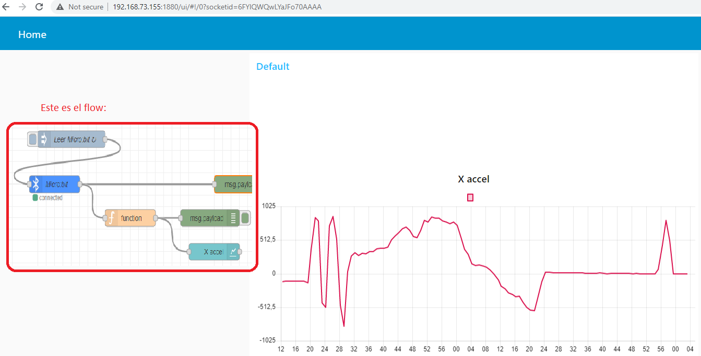

# Flujos Node-RED

Se crea esta carpeta para respaldo de los flujos que corren en la RPi4:

    /home/alumno/repo/iot-uah/flows

Para cargarlos, pulsar el boton de importar y elegir dicha ruta.

## 2. MQTT y NodeJS

## 3. RPi4

- Un LED (instalar el paquete ‘node-red-contrib-ui-led’) que indique el estado del GPIO18.
- Dos button (dasshboard) que permitan controlar el GPIO18.

## 4. BLE con MicroBit

## 7. MQTT con Micropython

El ESP32 se conectará a una WiFi (TBC). Cada 4 s enviará el valor de **dos sensores**  usando protocolo MQTT (**topic_esp**)

